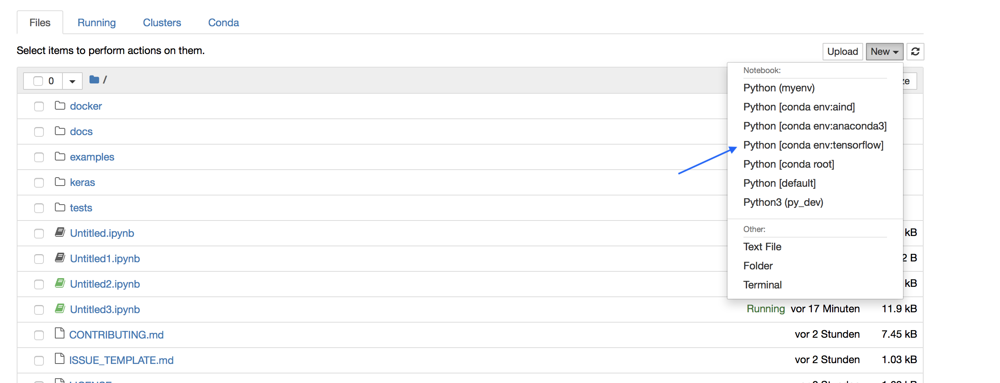
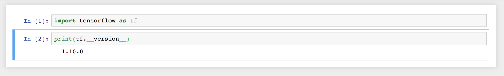

# Installing Tensorflow into a virtual environment with Anaconda

1. Install Miniconda for your OS ([https://conda.io/miniconda.html](https://conda.io/miniconda.html)) and open up a terminal
2. Create a virtual environment and install Python version 3.5: 
`conda create -n tensorflow python=3.5`
3. Activate environment: 
`conda activate tensorflow`
4. Install remaining packages (jupyter, notebook, tensorflow, matplotlib): 
`conda install jupyter notebook tensorflow matplotlib`

If everything went well, you should be able to start up the notebook server with `jupyter notebook` (please activate the environment before).
Create a new notebook and select the fresh environment as your kernel. 

If everything went well you should be able to import tensorflow as follows: 

